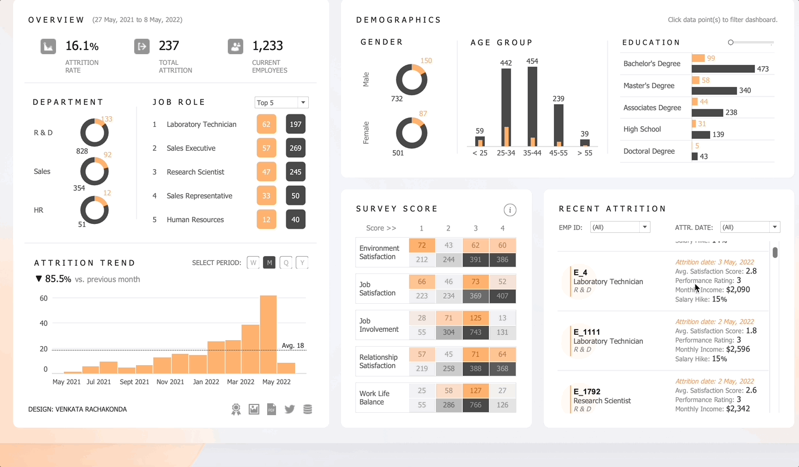

# HR Attrition Analysis Dashboard

## Overview
This Tableau dashboard provides an in-depth analysis of HR attrition...

#### Demographics
- **Age Analysis**: Breakdown of attrition rates by age groups.
- **Gender Statistics**: Comparison of attrition rates between different genders.
- **Education Level**: Attrition rates categorized by the education level of employees.

#### Department and Job Role Stats
- **Department-Wise Analysis**: Overview of attrition rates in different departments.
- **Job Role Statistics**: Insights into which job roles face higher attrition rates.

#### Attrition Trends
- **Historical Trends**: Visualization of how attrition rates have changed over time.
- **Seasonal Variations**: Identification of any seasonal patterns in attrition rates.

#### Survey Score Analysis
- **Employee Satisfaction**: Correlation between survey scores and attrition rates.
- **Feedback and Trends**: Analysis of how employee feedback relates to their likelihood of leaving.

#### Recent Attrition Scores
- **Latest Data**: Most recent attrition statistics.
- **Quick Insights**: Key takeaways from the latest data.

## Using the Dashboard
- Navigate through different sections using the tabs at the top of the dashboard.
- Hover over charts and graphs for more detailed information.
- Filter results based on department, job role, and other demographics for customized insights.

## Getting Started
To get started, open the Tableau dashboard file `HR_Attrition_Analysis.twbx` in Tableau Desktop or Tableau Viewer. Ensure you have the necessary permissions to access the data sources connected to this dashboard.
